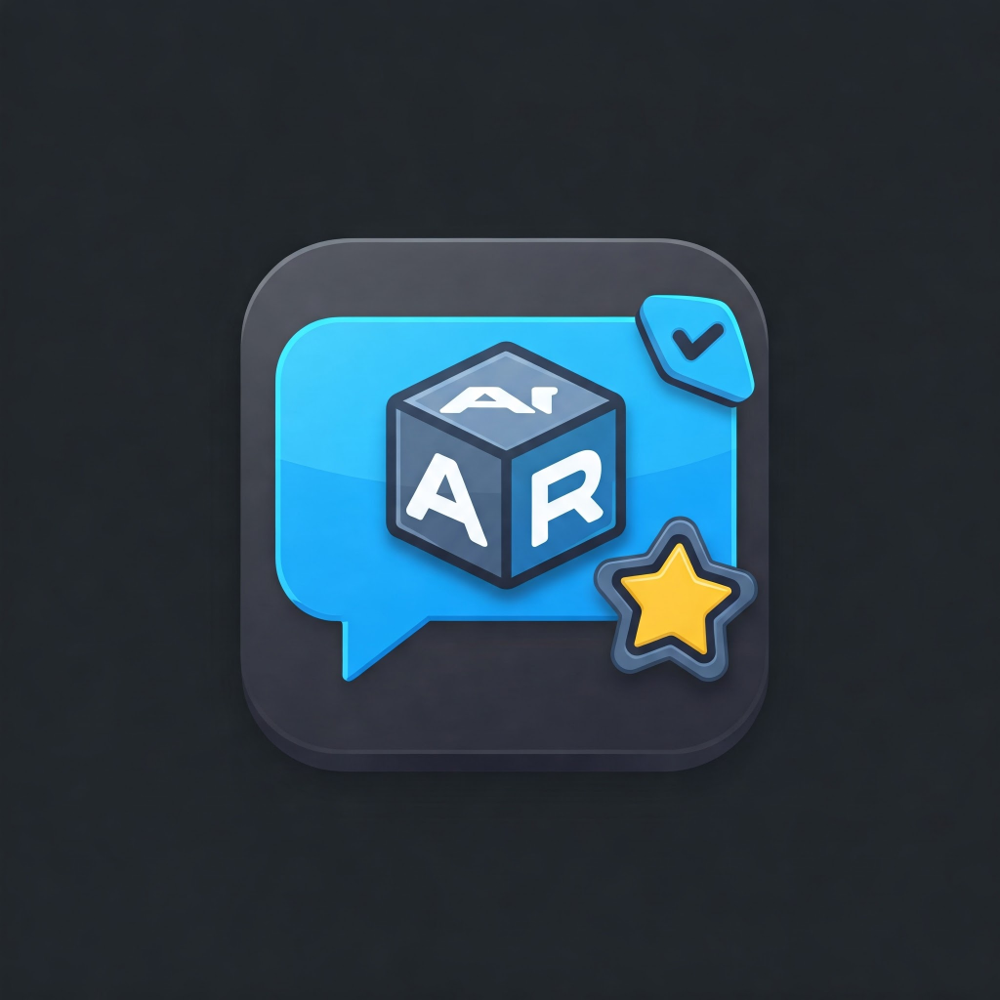

# AR React App

  

## 概要

AR 上でコメントやスタンプを投稿できる SNS アプリ。

## 背景

[Na7ti](https://github.com/Na7ti)さんが以前作った[web アプリ](https://github.com/Na7ti/webapp)をモバイルアプリを元に AR 上の SNS にリメイクする。

## 開発メンバー

## Contributors

<svg width="100" height="100">
  <circle cx="50" cy="50" r="50" fill="url(#developer1)" />
  <defs>
    <pattern id="developer1" patternUnits="userSpaceOnUse" width="100" height="100">
      <image href="https://github.com/Na7ti.png" width="100" height="100" />
    </pattern>
  </defs>
</svg>
<svg width="100" height="100">
  <circle cx="50" cy="50" r="50" fill="url(#developer2)" />
  <defs>
    <pattern id="developer2" patternUnits="userSpaceOnUse" width="100" height="100">
      <image href="https://github.com/Shiraishi-Shodai.png" width="100" height="100" />
    </pattern>
  </defs>
</svg>
<svg width="100" height="100">
  <circle cx="50" cy="50" r="50" fill="url(#developer3)" />
  <defs>
    <pattern id="developer3" patternUnits="userSpaceOnUse" width="100" height="100">
      <image href="https://github.com/ruiki1024.png" width="100" height="100" />
    </pattern>
  </defs>
</svg>
<svg width="100" height="100">
  <circle cx="50" cy="50" r="50" fill="url(#developer4)" />
  <defs>
    <pattern id="developer4" patternUnits="userSpaceOnUse" width="100" height="100">
      <image href="https://github.com/seiyazb.png" width="100" height="100" />
    </pattern>
  </defs>
</svg>
<svg width="100" height="100">
  <circle cx="50" cy="50" r="50" fill="url(#developer5)" />
  <defs>
    <pattern id="developer5" patternUnits="userSpaceOnUse" width="100" height="100">
      <image href="https://github.com/Kai15-kuro.png" width="100" height="100" />
    </pattern>
  </defs>
</svg>

## 主な機能

- Google アカウントでログイン・ログアウト
- 長押しすると表示されるコントローラーでスタンプモードとコメントモードを切り替え
- スタンプ・コメントを追加
- 全ユーザーが投稿したスタンプ・コメント一覧を表示
- ログイン中のユーザーが投稿したスタンプ・コメント一覧を表示
- 特定のスタンプ・コメントを削除
- スタンプ・コメントの詳細を表示

## 苦労したところまたは失敗したこと、対策

### 技術面

#### 1. 未知の技術を多く取り入れた

---

**これにより発生する問題**

- プログラミング自体は特になのに、何をしたらいいかわからないメンバーがいた。

---

**具体的な原因**

- ReactNative, TypeScript, Firebase, Expo など未知の技術を複数使ったためコードの書き方がわからず、システム開発に取りかかれないメンバーがいた
- これらの新しい技術を使用することは、[Shiraishi-Shota](https://github.com/Shiraishi-Shodai)が提案したが、私自身も他のメンバーに説明できるほどこれらの技術スタックに精通していなかった。

---

**対策**

- 新しい技術に挑戦することは良いが、チームで開発を行う際はなるべく全員が使い慣れた技術を使って開発を行う。
- よほどの学習意欲のあるチームや新しい技術に精通しておりチーム全員に教えれる人がいない限り、チーム開発で新しい技術を使うことは避ける

#### 2. 座標固定の際に時間と人をかけすぎた

---

**これにより発生する問題**

他の機能の実装がかなり遅れた。

---

**具体的な原因**

- 位置情報の固定を試みたが、1 カッ月ほど立っても成果がでず、その間全ての工程がストップしてしまった。

---

**対策**

- ガントチャートを基に各機能の実装にかけるリソースを調整する。

#### 3. Android アプリを開発するという選択

**これにより発生する問題**

チームの 5 人の内 2 人は Android デバイスを持っていなかったため、開発を思うように進められなかった。

---

**具体的な原因**

- ReactNative を使ったモバイルアプリ開発に初めて取り組んだため、開発を始めるまで iPhone アプリが開発できないことに気づかなかった。

---

**対策**

- iPhone アプリが開発できないと、わかった時点でアプリの概要を考え直してもよかったかもしれない。
- 開発環境はチーム全員が確実に用意できるようにする。

#### 4.他の人が書いたコードを理解できなかった。

---

**これにより発生する問題**

- 時間を浪費する
- やる気が低下する

---

**具体的な原因**

- github の issue をメンバーが使い慣れていない。
- issue の書き方が統一されていない
- コメントが少ない
- 誰が担当したコードかわからない

---

**対策**

- github の issue はメンバーが馴れていないなら使わない。
- issue を使うなら書き方を統一する。
- コメントを丁寧に書く。
- コミット前に自分が書いたコードが読みやすいか見直す。
- コードができた時点でみんなにあらためて説明する。

### チームワーク面

---

#### 1. プロジェクトの進捗を確認する頻度が非常に少なかった。

---

**これにより発生する問題**

チーム全体でプロジェクトがどこまで進んでいて、今何をやらなければいけないのか共有出来ておらず何から手をつければよいのかわからないメンバーがいた。

---

**具体的な原因**

- そもそもチーム内でコミュニケーションを取る機会が少なかった。
- ガントチャートの各工程の単位が大きすぎたため、頻繁にガントチャートを更新する必要に迫られなかった。
- 誰がプロジェクト管理を行うのかが不明確だった。

---

**対策**

- 毎時間、授業の最初と最後にプロジェクトの進捗を確認する。
- ガントチャートは WBS などを使ってもっと細かい単位に各工程に分ける。また、いつでもみんなが何をやっているかを詳細に確認できるようなメモがあってもよかったかもしれない。
- プロジェクト管理の担当者を決めておく。

---

#### 2. クラス図、データベース設計の不足(設計担当者：Shiraishi-Shodai)

---

**これにより発生する問題**

システムの機能(コメント追加など)を実現するための詳細はチーム全体で共有するのではなく、開発担当者に考えてもらうような形をとったが、その際にクラス図やデータベース設計の理解が出来ていないことがあり、担当者が何をすればいいか困ってしまった。  
また、データベース設計は予め大まかに決めておいたものの、いざある機能を実装しようとすると決めておいた設計内容では機能が実現できない、または非効率となることがあった。  
そして、それに伴いが行った変更においてもチーム内で十分に共有されておらず、開発が進むに連れて他のメンバーはどんどんついていけなくなった

---

**具体的な原因**

- チーム全員がクラス図やデータベース設計の理解が出来ているわけではなかった。
- 設計の精度が甘かった。
- 変更内容をチーム全体で共有できていなかった。

---

**対策**

- 設計担当者(Shiraishi-Shodai)がメンバー全員が分かるように説明する。
- もっとメンバー全員の意見を聞きながら設計を進めていくと全員が理解できる設計になったかもしれない
- メンバー全員がわかるように説明するためには、この設計をした理由や背景を説明する
- 設計はもっと時間をかけて予め詳細にしておくことで開発途中での変更をなるべく少なくする。
- チーム全体でシステムの流れに沿って仮で検証を行っておくことで全員が理解しやすく、より正確な設計にする。
- データベース設計やクラス図に変更を加えた場合は、変更した人がその都度その背景と変更内容をみんながわかりやすい形で共有、説明する。
- ドキュメント類は Teams のフォルダにまとめて全員がいつでも確認出来るようにしておく。できれば変更過程の設計書と変更内容の説明書きを日付と共にわかるように管理しておく。

---

#### 3. プロジェクトを進める中で、プロジェクト管理不足やドキュメント認識不足などを解決するために授業の最初と最後に進捗確認と疑問を共有する時間を設けようと試みたが、習慣化出来なかった。

---

**これにより発生する問題**

引き続き、プロジェクト管理不足やドキュメント認識不足が解決できず、状況がよくならない。

---

**具体的な原因**

- 授業開始時に Shota-Shiraishi は各メンバーのもとに行き、声をかけることが恥ずかしかくメンバーを呼びに行かなかったため、メンバーが集まらないことがあった。
- ガントチャートの各工程の単位が大きすぎたため、集まってもみんなが具体的に何をやっているのかわからなかった。

---

**対策**

- Shiraishi-Shota は、メンバーを呼ぶのが恥ずかしいのなら予め、授業開始時に集まる場所を決めておく
- ガントチャートの各工程は、WBS などを使ってもっと細かい単位に各工程に分ける

- リーダーが不在だった。
  - リーダーをチーム内で決めておくことで、役割分担を割り振りやすくするべきだった。
- 副リーダーが不在だった。
  - リーダーがいないときでもプロジェクトをするめるために副リーダーを決めておいたほうがよかった。

## 上手く行ったこと

- システムの規模を予め小さめに設定しておいたため、なんとか完成させることが出来た。
- オブジェクト指向を用いてシステム開発が出来た。

## 個人としての反省

### [Shiraishi-Shodai](https://github.com/Shiraishi-Shodai)

- 自分が最も今回使用する技術スタックに馴れており、かつチームメンバー全員とコミュニケーションを取りやすい立場にあったためみんなを引っ張らなければならなかったがそれが出来なかった。

  - 技術不足
  - 毎時間、予め準備をして取り組むことが出来なかった。
  - リーダーかどうか微妙な役割をこなしており、みんなに指示をすることをためらうことがあった。

- プロジェクトの進捗管理を行わなかった。
- 自分の頭に描いていることをドキュメントや図に表してチームに共有することなく、単独で開発を行ってしまった。
- チームメンバー 1 人 1 人と向き合って、それぞれが向いている分野の役割を見つけ出せればよかったかもしれない。
- 位置情報を固定するために、かなりを時間を消費してしまった。難しいところは後回しにして手を付けられる場所から進めて行くほうが効率的だったと感じる。
- 授業のはじめと終わりの進捗報告は途中で終わらせることなく、続けるべきだった。
- 要件定義などで意見を出す際には、決して否定せずどんどんみんなの意見を発言してもらうようにすべきだった。
